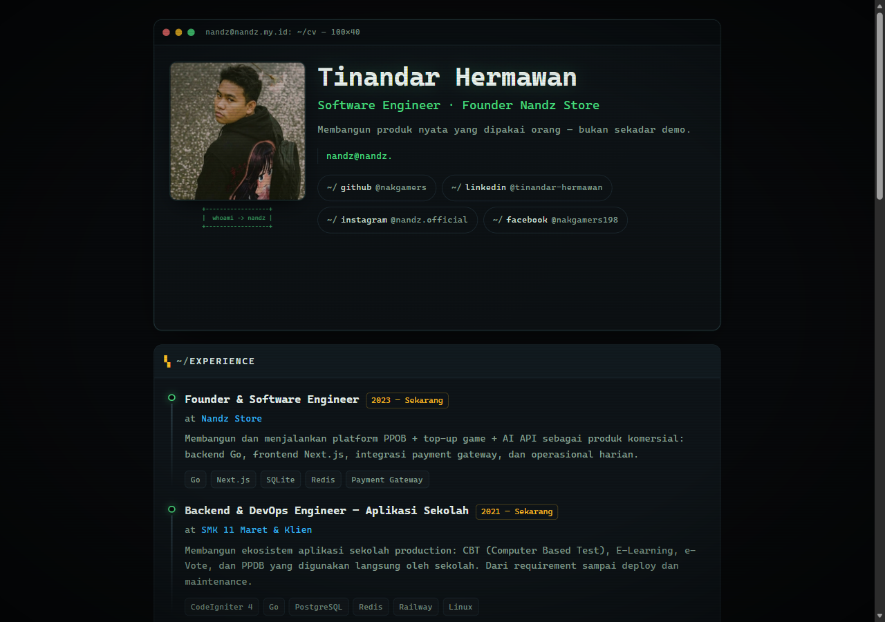
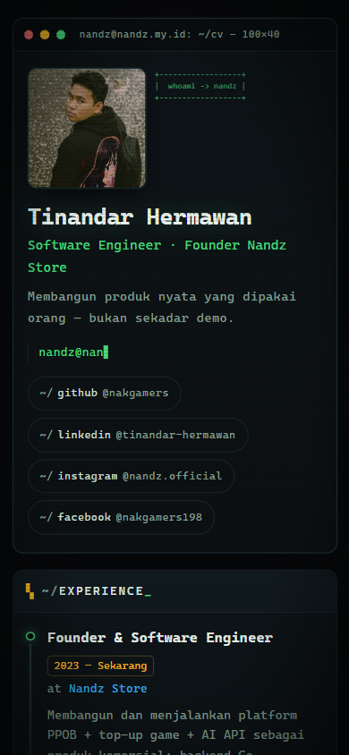

# nandz.my.id — Terminal Kernel CV

> Online CV / portfolio with a **retro kernel-terminal aesthetic** — boots like a Linux kernel, types like a real shell.

Live: **nandz.my.id** (custom domain; deploy via GitHub Pages)




## ✨ Features

- **Kernel boot sequence** — `[ ok ]` style startup log, then a full-screen CRT terminal
- **Typing animation** — `cat intro.md` types out the intro line by line
- **GitHub achievements** — pulled from your GitHub profile, shown as badges in a dice-5 layout (desktop) or 3+2 (mobile)
- **ASCII art frame** under the profile photo
- **Scanline + CRT vignette** overlay for the true CRT look
- **Fully responsive** — mobile-first, single column on phones, two-column on desktop
- **Zero runtime framework bloat** — static build, loads instantly

## 🛠 Tech Stack

| Layer    | Tech                          |
| -------- | ----------------------------- |
| Framework| React 19                      |
| Build    | Vite 8                        |
| Language | TypeScript                    |
| Style    | Hand-written CSS (no framework) |
| Deploy   | GitHub Pages (workflow)       |

## 🚀 Run Locally

```bash
git clone https://github.com/nakgamers/cv-nandz.git
cd cv-nandz
npm install
npm run dev      # http://localhost:5173
```

Build for production:

```bash
npm run build    # output to dist/
npm run preview  # preview the build
```

## 📁 Project Structure

```
├── public/
│   ├── profile.jpg          # profile photo
│   └── ach/                 # GitHub achievement badge icons
├── src/
│   ├── App.tsx              # layout + boot/typing logic
│   ├── data.ts              # ← ALL CV CONTENT (edit this)
│   ├── ach.ts               # achievement list
│   ├── index.css            # theme + layout
│   └── components/          # Boot, Photo, Experiences, Projects, ...
└── .github/workflows/deploy.yml  # auto-deploy to Pages on push
```

**Want to make it yours?** Edit `src/data.ts` — profile, experience, projects, certifications, education, and skills are all there. Swap `public/profile.jpg` for your photo.

## 🎨 Customization

- **Theme colors**: CSS variables in `src/index.css` (`:root`)
- **Boot messages**: `src/components/Boot.tsx`
- **Intro text**: `about` array in `src/data.ts`
- **Achievements**: `src/ach.ts` (icons in `public/ach/`)

## 📦 Deploy (GitHub Pages)

Already automated. Push to `main` and the workflow (`.github/workflows/deploy.yml`) builds and deploys to GitHub Pages.

For user/org pages, set `base: '/'` in `vite.config.ts` (already done).

## 📝 License

MIT — fork it, use it, make it yours.

---

Made with ☕ by [Tinandar Hermawan](https://github.com/nakgamers)
